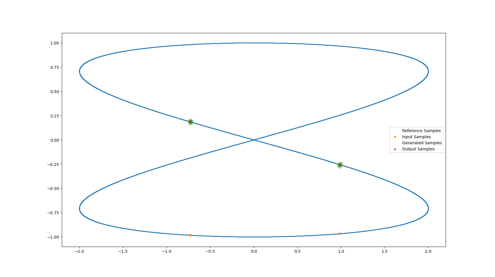
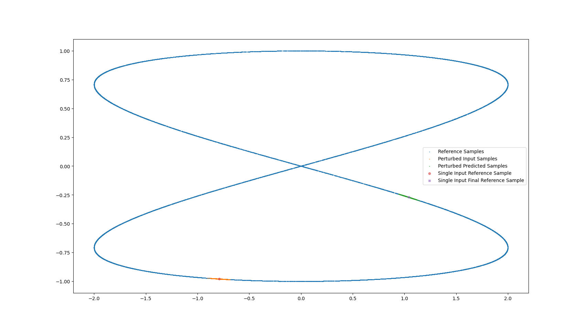

# FM4UQ
Flow matching for sampling perturbed initial states and sensitivity analysis of dynamical systems.

System: 2-mode Harmonic Oscillator 
$$\ddot{x} + \omega^2 x = 0$$  
$$\ddot{y} + k^2 \omega^2 y = 0$$  

Amplitude $$A = 2$$  
Skewness factor $$k = 0.5$$  
Angular Velocity $$\omega = 2$$  

Exact Solution (Parametric):  
$$x = 2sin(2t) $$  
$$y = cos(t) $$  

Exact Solution (State Space):  
$$x^2 = 16y^2 \(1-y^2\) $$  

So, residual ($x_1$ , $y_1$) = $${x_1}^2 - 16{y_1}^2 (1-{y_1}^2)$$ .     
Also, amplitude  ($x_1$ , $y_1$) = $$\frac{8y_1^2}{(16y_1^2 - x_1^2)^{0.5}}$$ .    

| Metric  | Diffusion  | Ours  | 
|---|---|---|
|Mean Residual   | 1.6158e-02  | 6.7683e-04  |
|Mean Squared Residual   | 5.4663e-03  | 2.7638e-06  |
|Mean Amplitude   | 1.177e+00  | 1.997e+00  |
|Mean Squared Error of Amplitude | 8.173e+01  | 3.664e-02  |

 Forcasting using diffusion

 Forcasting using our method

time = $\pi$/4
| $\sigma$	| 0.001	| 0.005 |	0.01	| 0.02 | 0.05 |	0.1	| 0.2	| 0.5 |
|----|----|----|----|----|----|----|----|---|
| Mean Residual |	-8.22E-04 |	-7.97E-04 |	-8.29E-04 |	-9.40E-05 |	2.55E-03 |	 -1.1334e-03  |	-2.58E-03 |	-2.60E-01 |
| Mean Squared Residual |	7.01E-07 |	1.22E-06 |	3.01E-06 |	1.10E-04 |	2.38E-04 |	2.05E-04 |	7.39E-04 |	7.30E+00 |
| Mean Amplitude |	2.00E+00 |	2.00E+00 |	2.00E+00 |	2.00E+00 |	2.00E+00 |	2.00E+00 |	2.00E+00 |	2.02E+00 |
| Mean Squared Error of Amplitude |	1.14E-03 |	1.50E-03 |	2.36E-03 |	1.43E-02 |	2.09E-02 |	1.95E-02 |	3.45E-02 |	3.78E-01 |

time = $\pi$/8
| $\sigma$	| 0.001	| 0.005 |	0.01	| 0.02 | 0.05 |	0.1	| 0.2	| 0.5 |
|----|----|----|----|----|----|----|----|---|
|Mean Residual	| 2.46E-03 |	1.88E-03 |	1.18E-03	| 5.00E-04 |	7.41E-04 |	1.49E-03 |	3.90E-03	| 3.3071e-02| 
|Mean Squared Residual |	6.07E-06 |	3.86E-06 |	2.47E-06 |	1.67E-06 |	2.74E-06 |	7.45E-06 |	9.59E-05 |	6.18E-02|
|Amplitude |	1.98E+00 |	1.41E+00 |	1.99E+00 |	2.00E+00 |	2.00E+00 |	1.99E+00 |	1.92E+00 |	1.87E+00|
|Mean Squared Error of Amplitude | 6.09E-02 |	2.21E-01	| 3.91E-02	| 3.26E-02 |	4.17E-02 |	6.64E-02	| 3.97E+00 |	9.20E+00 |
